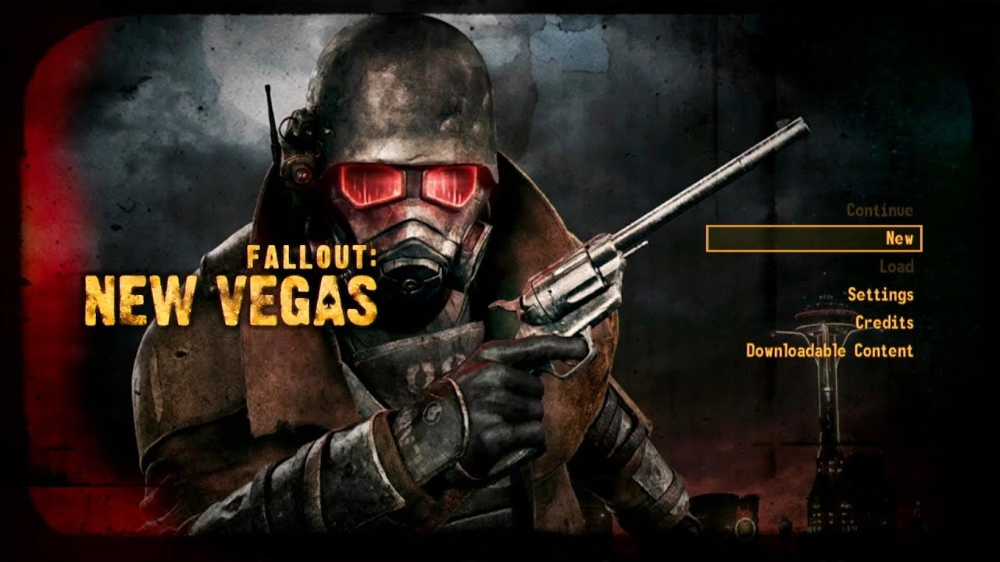

# dx9mt

A DirectX 9 to Metal translation layer for running **Fallout: New Vegas** natively on macOS via Wine. Intercepts D3D9 API calls, captures rendering state into packets, and replays them through Apple Metal for native GPU rendering.

<table>
<tr>
<td align="center" width="50%"><strong>dx9mt (Metal, rendering perfectly)</strong></td>
<td align="center" width="50%"><strong>Original (DirectX 9)</strong></td>
</tr>
<tr>
<td width="50%"></td>
<td width="50%"></td>
</tr>
</table>

## How It Works

```
FalloutNV.exe (i686 / Wine)
        │
        ▼
┌────────────────────────────────────┐
│  d3d9.dll (PE32, MinGW)           │
│  Implements IDirect3DDevice9       │
│  Captures all state into packets   │
└───────────────┬────────────────────┘
                │  packets + upload arena refs
                ▼
┌────────────────────────────────────┐
│  Backend Bridge (compiled twice:   │
│  PE32 for DLL, ARM64 for dylib)   │
│  Validates, records, assembles IPC │
└───────────────┬────────────────────┘
                │  256MB shared memory
                ▼
┌────────────────────────────────────┐
│  Metal Viewer (native ARM64)       │
│  Translates D3D9 shaders → MSL    │
│  Renders via Metal into NSWindow   │
└────────────────────────────────────┘
```

The frontend DLL replaces the system `d3d9.dll` inside a Wine prefix. Every D3D9 call — draw commands, state changes, texture uploads — is captured into full-state packets and written to a triple-buffered upload arena. A backend bridge serializes each frame into a 256MB shared memory file, which a standalone native Metal viewer polls and renders in real time.

## Current Status

- **Main menu**: rendering correctly with full shader translation
- **Shader translation**: SM 1.0–3.0 bytecode → MSL, compiled and cached per-frame
- **Texture formats**: DXT1/DXT3/DXT5, A8R8G8B8, X8R8G8B8, A8
- **Render state**: depth/stencil, blending, culling, scissor, fog, color write masks
- **Multi-texture**: 8 texture stages in the packet/IPC path
- **Resource management**: textures, render targets, vertex/index buffers, shaders, declarations, queries

### Known Gaps

- In-game rendering is a work in progress (upload arena overflow on heavy frames)
- `Direct3DCreate9Ex` / D3D9Ex path not supported
- Volume textures not supported
- `DrawPrimitive` is stubbed (FNV uses indexed draws exclusively)

## Building

Requires macOS (ARM64), an `i686-w64-mingw32-gcc` cross-compiler, and Xcode command-line tools.

```sh
# Build everything (DLL + dylib + viewer)
make -C dx9mt

# Run contract tests
make test

# Build, install DLL into Wine prefix, and launch FNV + viewer
make run
```

### Build Outputs

| Artifact | Arch | Description |
|----------|------|-------------|
| `build/d3d9.dll` | PE32 (i686) | D3D9 frontend — replaces system DLL in Wine prefix |
| `build/libdx9mt_unixlib.dylib` | ARM64 | Backend bridge library |
| `build/dx9mt_metal_viewer` | ARM64 | Standalone Metal viewer, reads IPC shared memory |

## Architecture

The project has three layers connected by shared-memory IPC:

**Frontend** (`d3d9_device.c`, ~5500 lines) implements the full `IDirect3DDevice9` COM interface. Each `DrawIndexedPrimitive` call snapshots the entire device state (~800 bytes) into a packet — render states, shader constants, bound textures, vertex declarations — and uploads bulk data (geometry, textures, bytecodes) to a triple-buffered 3x128MB arena.

**Backend Bridge** (`backend_bridge_stub.c`, ~1400 lines) is compiled into *both* the PE32 DLL and the ARM64 dylib. It validates packets, records draw commands (up to 8192/frame), and on `Present()` serializes everything into the IPC region with atomic release/acquire synchronization.

**Metal Viewer** (`metal_viewer.m`, ~2800 lines) polls the IPC sequence number, parses D3D9 shader bytecode into MSL via a custom transpiler, and renders through Metal with extensive caching (textures, samplers, pipeline states, shaders — all keyed by content hash).

See [`docs/architecture.md`](docs/architecture.md) for full details.

## License

MIT License
