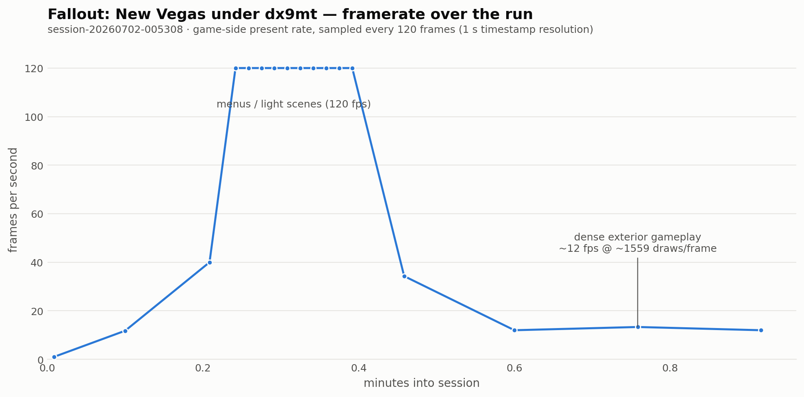

# dx9mt

A Direct3D 9 to Metal translation layer for running Fallout: New Vegas on macOS via Wine. A Wine-side `d3d9.dll` captures D3D9 state and bulk uploads, a shared backend bridge serializes each frame into shared memory, and a native Metal viewer replays the frame on Apple GPUs.

## Current State

As of July 2, 2026:

- **In-game 3D rendering is correct.** The long-standing geometry corruption was root-caused to the MSL emitter mishandling non-prefix destination write masks (`add r0.yzw, ...`) — 22% of all instructions in FNV's shipped shaders were miscompiled. The emitter now builds full-width results and stores through mask selection.
- The translated-shader path is validated against the game's own corpus: all 15,535 real shaders in `Data/Shaders/*.sdp` parse and emit, and sampled Metal compilation passes (`dx9mt/tests/corpus_emit_test.m`).
- D3D9 fixed-function **alpha test** and **table fog** are emulated inside every translated pixel shader via a per-draw params buffer (leaf cutouts, distance haze).
- The shader parser is self-checking: SM2+ operand-length fields are validated on every instruction, so an opcode-table mistake fails one shader cleanly instead of desyncing into compilable garbage.
- Draws upload only the geometry they reference (index-scan windowed uploads), keeping every IPC frame self-contained; the viewer replays from a per-frame shared geometry buffer instead of thousands of per-draw allocations.
- Frame-time instrumentation is built in: the runtime log carries a per-120-frame ledger (`frame_ms`, `draw_ms` with hash/upload/submit buckets, `present_ms`, `api_ms`, `game_ms`, draws/frame).

### Performance snapshot (M4 Pro, dense exterior, ~1,000 draws/frame)

| Stack | Frame time | Notes |
|-------|-----------|-------|
| dx9mt @ wine-crossover 23.7.1 + msync | ~68 ms (~15 fps) | smoothest frame pacing; `make run-msync` |
| dx9mt @ upstream Wine 11 | ~77 ms (~13 fps) | `make run` |
| wined3d (GL) @ upstream Wine 11 | ~50–55 ms (~18–20 fps) | matched-settings baseline; `make run-wined3d` |

Menus and light scenes run at 120+ fps on all stacks. The ledger attributes ~50 ms of the dense-exterior frame to the game engine itself under Rosetta 2 (FNV shipped unoptimized, single-thread-heavy); dx9mt's own cost is ~18 ms with known reductions remaining (dirty-region texture tracking, zero-copy viewer buffers, command-stream threading).



## How It Works

```text
FalloutNV.exe (i686 / Wine)
        |
        v
+------------------------------------+
| d3d9.dll (PE32, MinGW)             |
| Implements IDirect3DDevice9        |
| Captures draws, clears, blits,     |
| shaders, textures, and state;      |
| windowed VB/IB uploads, per-frame  |
| bytecode/constants dedup           |
+----------------+-------------------+
                 | packets + 3 x 256MB upload arena refs
                 v
+------------------------------------+
| Backend Bridge (compiled twice)    |
| PE32 inside the DLL, ARM64 inside  |
| libdx9mt_unixlib.dylib             |
| Validates packets, fails closed on |
| missing payloads, assembles the    |
| shared-memory IPC on Present()     |
+----------------+-------------------+
                 | 256MB IPC file (seqlock frames)
                 v
+------------------------------------+
| Metal Viewer (native ARM64 macOS)  |
| Replays draws and StretchRect      |
| Translates D3D9 bytecode to MSL    |
| (+ alpha-test / fog emulation)     |
| Renders via Metal into NSWindow    |
+------------------------------------+
```

The frontend DLL replaces `d3d9.dll` inside a Wine prefix. Each indexed draw snapshots device state into a packet and uploads exactly the vertex/index window the draw references (index values are rescanned and rebased — the API's `MinVertexIndex`/`NumVertices` hints are never trusted). The backend serializes the frame into `/tmp/dx9mt_metal_frame.bin`; the standalone viewer snapshot-copies and replays it, caching compiled shaders by id and binding geometry from a triple-buffered shared buffer.

## Running

```sh
make run                # build + install DLL + launch FNV (NVSE) + viewer, upstream Wine
make run-msync          # same, hosted on wine-crossover FOSS + WINEMSYNC=1 (fastest/smoothest)
make run-wined3d        # baseline: Wine's builtin wined3d with fps tracing
make test               # backend contract tests

tools/plot_fps.py       # chart the newest session's framerate into assets/
```

Sessions log to `dx9mt-output/session-*/`. In the viewer, press `d` to dump the current frame for per-draw ground truth.

## Coverage

- Shader translation for SM 1.x–3.0 with write-mask-correct stores, `sincos`/`texldl`/`texldd`/`dsx`/`dsy` support, and per-shader-id function caches.
- Indexed draws, triangle fans (re-indexed to lists), `Clear`, offscreen render targets, `StretchRect`, depth state, blending, scissor, cull, alpha test, table fog, and up to 8 texture stages.
- Formats: DXT1/3/5, A8R8G8B8, X8R8G8B8, A8, R32F, A16B16G16R16, A16B16G16R16F.
- Render-target-to-texture linkage so later passes sample earlier offscreen output.
- Diagnostics: per-session runtime/viewer logs with drop counters and the perf ledger, shader/PSO failure artifacts, frame dumps.

## Known Limitations

- The HDR/imagespace post-process chain is incomplete — the scene lacks the game's color grading (the wasteland "yellow" filter) and bloom.
- No MSAA yet; edges are aliased.
- Texture uploads ride a lossy channel with an 8-frame refresh net; occasional texture pop/flicker until dirty-region tracking + a persistent resource heap land.
- Stencil silently no-ops; mid-frame depth clears collapse to one per frame (minor viewmodel z artifacts); separate-alpha blending is not captured.
- `DrawPrimitive` and the UP draw calls are no-op stubs (FNV renders via `DrawIndexedPrimitive`).
- IPC caps at 2,048 draws per frame.

## Building

Requires macOS (ARM64), Xcode command-line tools, and an `i686-w64-mingw32-gcc` cross-compiler.

```sh
make -C dx9mt      # DLL, backend dylib, viewer
make test          # contract tests

# Shader corpus regression (needs the game's Data/Shaders):
cd dx9mt/tests && clang -O2 -I../src/tools -framework Metal -framework Foundation \
  corpus_emit_test.m ../src/tools/d3d9_shader_parse.c ../src/tools/d3d9_shader_emit_msl.c \
  -o corpus_emit_test && ./corpus_emit_test "<FNV>/Data/Shaders"
```

| Artifact | Arch | Description |
|----------|------|-------------|
| `build/d3d9.dll` | PE32 (i686) | D3D9 frontend injected into Wine |
| `build/libdx9mt_unixlib.dylib` | ARM64 | Backend bridge library |
| `build/dx9mt_metal_viewer` | ARM64 | Standalone Metal frame replay app |

## Docs

- [`docs/architecture.md`](docs/architecture.md): packet, IPC, and viewer architecture (dated March 2026; predates the windowed-upload and emulation work)
- [`docs/insights.md`](docs/insights.md): implementation gotchas and debugging notes

## License

MIT License
