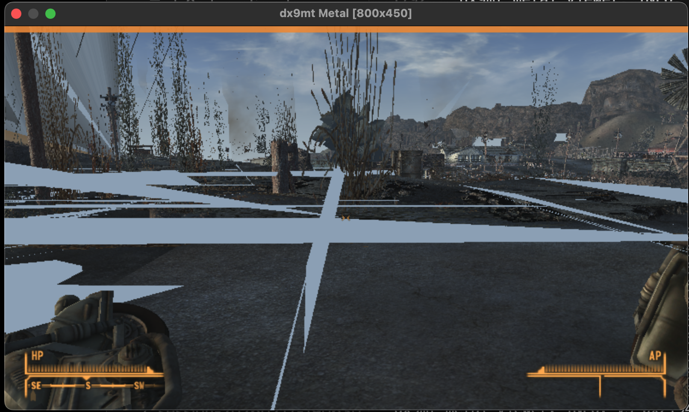

# Rendering Findings

Current evidence for the in-game rendering state as of March 5, 2026.

## Summary

The project has moved past the earlier blank-world phase. The Metal viewer now
shows the world, sky, terrain, props, HUD, and first-person weapon. The core
problem is no longer "can the frame reach the drawable?" but "how correct is
the replay once it gets there?"

The current image is still badly corrupted. Large white or light-blue planar
bands cut through the frame, billboard or foliage-heavy geometry spikes upward
into dense columns, and some scene-composite passes are still clearly wrong or
missing.

## What Changed Since The Blank-World Phase

- HDR offscreen render targets are now replayable:
  - The viewer maps `D3DFMT_A16B16G16R16F` (`113`, `0x71`) to
    `MTLPixelFormatRGBA16Float`.
  - Translated PSOs are keyed by the actual render-target pixel format, so the
    same shader pair can compile distinct pipelines for drawable and HDR paths.
- `StretchRect` is now a first-class packet and IPC command:
  - The frontend emits explicit blit metadata.
  - The backend records it alongside draw commands.
  - The viewer replays it through a dedicated full-screen blit path.
- Offscreen RT output is linked back into later sampling stages:
  - `render_target_texture_id` is forwarded through packets and IPC.
  - The viewer records RT-to-texture overrides so later passes can sample prior
    offscreen output.
- IPC replay is safer:
  - The backend writes `sequence = 0` before mutating shared frame data.
  - The viewer validates the header, snapshots the frame, then re-checks the
    sequence before replay.
- Upload pressure is reduced and texture behavior is more observable:
  - Upload arena slots increased from 128 MB to 256 MB each.
  - Texture refresh is now more aggressive.
  - Frontend and viewer both log why a texture did or did not resolve.

## What The Current Screenshot Confirms

Positive signals:

- The world scene is no longer missing entirely.
- Depth cues, sky, terrain, buildings, and the held weapon all appear.
- HUD composition on top of the 3D scene is still intact.
- Broad scene lighting survives the replay path.

Visible failures:

- Large white or light-blue bands still span major parts of the screen.
- Some billboard or vegetation draws explode into vertical spikes or dense point
  clouds.
- Ground and distant scene composition still look partially wrong.
- Some surfaces appear to be sampling the wrong source, an uninitialized source,
  or a partially correct source.

## Remaining Bug Buckets

### 1. Scene-composite and blit correctness

The world is visible now, which strongly suggests that HDR RT creation and
offscreen replay are no longer the first-order blocker. The remaining planar
artifacts likely point to one or more of:

- incorrect `StretchRect` source or destination rect normalization
- wrong load or clear ordering when switching render targets
- wrong source texture chosen for a later full-screen composite pass
- a translated shader pair that compiles but still computes the wrong composite

This section is still partly inference from the screenshot and the code paths.

### 2. Translated shader and PSO failures

The latest commit fixed several translator issues, but not all translated
programs are correct yet. Remaining failures still fall into familiar buckets:

- missing or mismapped VS inputs
- VS/PS interface mismatches at PSO creation time
- semantic mismatches between emitted `[[user(...)]]` attributes
- shader pairs that compile but still render incorrectly

Artifacts are now dumped as:

- `dx9mt_shader_fail_vs_<hash>.txt`
- `dx9mt_shader_fail_ps_<hash>.txt`
- `dx9mt_pso_fail_<key>.txt`

### 3. Billboard, alpha-test, or foliage replay issues

The screenshot shows several geometry classes stretching into long vertical
spikes. Plausible sources include:

- vertex declaration or attribute-width mismatches
- remaining POSITION or POSITIONT handling errors
- depth, cull, or alpha-tested billboard state not matching D3D9 behavior
- fallback rendering paths being "good enough" to show content but not correct
  enough to preserve the intended shape

### 4. Texture availability and cache seeding

Some draws still arrive with texture metadata but no upload payload:

- `upload_size == 0` is not automatically wrong if the viewer already has the
  texture cached.
- It is still wrong for first use if the viewer has neither a cache entry nor
  an RT override for that texture ID.
- The viewer now logs whether a texture resolved via `rt_override`, `cache`,
  `upload`, `cache_miss`, or invalid bulk range.

### 5. Heavy-frame upload pressure

The larger upload arena moves the failure point later, but it does not remove
the problem entirely. Heavy frames can still fail due to:

- upload-copy failure in the frontend
- missing constants or geometry payloads in IPC
- invalid bulk ranges discovered by the viewer during replay

## Diagnostics That Matter Most Now

Frontend/runtime:

- `dx9mt_runtime.log`
  - `dx9mt/rttrace` for render-target lifecycle and sampled `Present()` routing
  - `dx9mt/texdiag` for texture upload skip reasons

Viewer:

- `dx9mt_viewer.log`
  - draw skip reasons
  - texture resolution source
  - render-target materialization and RT-link logging
  - per-frame diagnostics totals
  - per-frame cohort summaries grouped by RT, shader hashes, and texture mask

Artifacts:

- `dx9mt_shader_fail_vs_<hash>.txt`
- `dx9mt_shader_fail_ps_<hash>.txt`
- `dx9mt_pso_fail_<key>.txt`
- `dx9mt_frame_dump*.txt`

## Current Priorities

1. Correlate the current visual artifacts with the new `dx9mt_viewer.log`
   cohorts instead of relying on the older blank-world signatures.
2. Audit `StretchRect` replay and later scene-composite passes first, because
   the large planar bands look like blit or post-process mistakes.
3. Continue fixing translated VS input, semantic, and PSO interface mismatches.
4. Audit billboard, alpha-test, and foliage-heavy draws for declaration-width,
   cull, depth, or fallback-path issues.
5. Keep reducing texture cache misses and heavy-frame upload failures once the
   main on-screen corruption is better classified.
